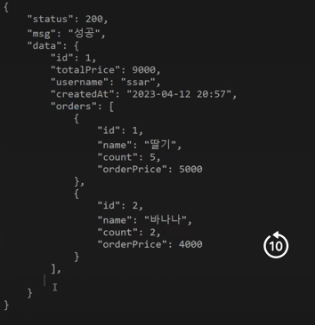

# AOP 학습을 위한 리포지토리

## 개발 순서 Model -> Service -> Repository -> Controller
1. 필터와 인터셉터의 차이
   - 요청을 언제 필터링할지 타이밍의 차이
   - 필터에서 처리한 것들
     - CORS 필터
     - CSRF 필터
     - 인코딩 필터
     - stateless 필터
   - 인터셉터에서 처리한 것들
     - 인증 처리 
     - 권한 처리
     - 인가 처리
     - 로깅 처리
2. DTO
   - ResponseDTO
   - ValidationDTO
3. AOP
   - Log
   - OrderSheet
4. 의존성 주입 (spring-boot-starter)
   - AOP
   - JWT
   - Validation
5. OOP - 상태(변수)는 행위(메서드)를 통해 변경한다. (캡슐화)
6. JPA - OOP를 이용해 객체간의 관계를 통한 영속성 관리 가능
   - 즉, MyBatis의 경우 데이터베이스의 테이블 구조에 의존해야 하는 단점이 있다. 
   - 데이터베이스의 스키마가 변경되면 SQL 쿼리와 매핑되는 XML 파일도 변경되어야 하기 때문이다.
   - 반면에 JPA를 사용하면 데이터베이스의 스키마 변경이 있더라도 대부분 자동으로 처리되므로, 비교적 유연한 코드 작성이 가능하다.
7. 양방향 매핑 : OrderProduct - OrderSheet
   - 연관관계의 비주인에서 mappedBy 속성으로 연관관계의 주인을 명시한다. 
   - 무한참조 방지해야 함
   - DB에서는 id를 통해 join한다.
   - 싱크를 위한 양방향 편의 메서드 필요
   - 구조가 복잡해진다.
8. 응답 DTO 작성하는 3가지 방법
 1) 응답이 존재하지 않는 요청 성공 - DELETE
```java
   ResponseDTO<User> v1 = new ResponseDTO<>();
```
   2) 응답이 존재하는 요청 성공 - GET, POST, PUT
   ```java
     ResponseDTO<User> v2 = new ResponseDTO<>().data("값");
```
   3) 요청 실패 - GET, POST, PUT, DELETE
   ```java
    ResponseDTO<User> v3 = new ResponseDTO<>().fail();
 ```
9. Filter는 예외 핸들러로 처리 불가능하므로, 예외의 응답DTO를 생성하는 유틸 클래스 작성
10. 옵저버 패턴을 사용하는 프론트앤드
    - 화면에 해당하는 상태를 관리하는 스토어를 가지고 있고, 해당 스토어를 화면에 뿌린다.
    - 스토어들은 스토어에 해당하는 리포지토리가 존재하고, 리포지토리는 서버의 API에 데이터를 요청한다.
    - 리포지토리와 API가 연동되어있는 상태에서, 화면이 스토어를 구독하고 있는 형태로 상태가 변경되면 변경감지를 통해 렌더링된다.
    - 따라서, 프론트엔드가 요청한 데이터에 해당하는 상태코드와 id값을 함께 전달해야한다. (GET, POST, PUT)
11. 유효성 실패, 잘못된 파리미터 요청시 커스텀 예외 클래스를 작성해 400 예외 반환
    - 유효성 실패 : 요청의 Body 데이터
    - 잘못된 파라미터 : @PathVariable
    - 400의 경우에는 메시지 뿐만 아니라, 잘못된 데이터를 함께 전달해야한다.
12. AOP를 이용해 코드의 중복 제거와 로직의 일관성 제공
    - AOP는 annoataion과 advice
    - @MyErrorLogRecord
    - @MySameUserIdCheck
    - @MySessionStore
13. MySessionArgumentResolver로 MySessionStore 구현
    - MySessionStore가 null이 아니거나, MySeesionStore의 파라미터가 SessionUser타입이면 세션에 세션 유저 주입
    - 권한 체크하는 인터셉터 작성
      - MyAdminInterceptor
      - MySellerInterceptor
    - WebMvcConfig 설정
      - CORS 설정
      - MessageConverter 설정
      - ViewResolver 설정
      - Interceptor 설정
      - ArgumentResolver 설정
    - FilterRegistrationBean에 필터 등록
14. 회원가입, 로그인
    - LoginDTO, JoinDTO
15. DTO 작성
    - Entity를 직접 노출시키면 안된다. -> 항상 DTO로 요청하고, DTO로 응답하도록 한다.
    - Entity에 ReqDTO를 만들 수 있도록 생성자에 @Builder 필요
    - ReqDTO의 경우 유효성 검사 필요 (INSERT의 경우 toEntity 메서드 필요, 없으면 매번 생성해야하므로, UPDATE는 더티체킹)
    - RespDTO의 경우 Entity로 만들기 때문에 엔티티를 이용해 생성자 작성 (JSON으로 보여주므로, 모두 문자열로 처리)
16. JPA에서의 페이징
    - @PageableDefault과 Pageable로 간단하게 페이징 구현
    - 쿼리 결과는 모두 Page 객체로, 제네릭 타입을 전달한다.
    - 즉, http://localhost:8080/products?page=2로 호출 가능
    ```java
    {
     {
    "status": 200,
    "msg": "성공",
    "data": {
        "content": [
            {
                "id": 21,
                "seller": {
                    "id": 2,
                    "username": "seller",
                    "email": "ssar@nate.com",
                    "role": "SELLER",
                    "status": true,
                    "createdAt": "2023-04-17T15:25:55.023427",
                    "updatedAt": "2023-04-17T15:30:44.096868"
                },
                "name": "바나나",
                "price": 3000,
                "qty": 50,
                "createdAt": "2023-04-17T15:40:00.697425",
                "updatedAt": null
            },
            {
                "id": 22,
                "seller": {
                    "id": 2,
                    "username": "seller",
                    "email": "ssar@nate.com",
                    "role": "SELLER",
                    "status": true,
                    "createdAt": "2023-04-17T15:25:55.023427",
                    "updatedAt": "2023-04-17T15:30:44.096868"
                },
                "name": "바나나",
                "price": 3000,
                "qty": 50,
                "createdAt": "2023-04-17T15:40:03.248966",
                "updatedAt": null
            },
            {
                "id": 23,
                "seller": {
                    "id": 2,
                    "username": "seller",
                    "email": "ssar@nate.com",
                    "role": "SELLER",
                    "status": true,
                    "createdAt": "2023-04-17T15:25:55.023427",
                    "updatedAt": "2023-04-17T15:30:44.096868"
                },
                "name": "바나나",
                "price": 3000,
                "qty": 50,
                "createdAt": "2023-04-17T15:40:03.662179",
                "updatedAt": null
            },
            {
                "id": 24,
                "seller": {
                    "id": 2,
                    "username": "seller",
                    "email": "ssar@nate.com",
                    "role": "SELLER",
                    "status": true,
                    "createdAt": "2023-04-17T15:25:55.023427",
                    "updatedAt": "2023-04-17T15:30:44.096868"
                },
                "name": "바나나",
                "price": 3000,
                "qty": 50,
                "createdAt": "2023-04-17T15:40:05.083647",
                "updatedAt": null
            }
        ],
        "pageable": {
            "sort": {
                "empty": true,
                "sorted": false,
                "unsorted": true
            },
            "offset": 20,
            "pageNumber": 2,
            "pageSize": 10,
            "paged": true,
            "unpaged": false
        },
        "last": true,
        "totalPages": 3,
        "totalElements": 24,
        "size": 10,
        "number": 2,
        "sort": {
            "empty": true,
            "sorted": false,
            "unsorted": true
        },
        "first": false,
        "numberOfElements": 4,
        "empty": false
    }
}
    ```

16. 상품상세보기
    - EAGER 전략으로, JOIN이 발생시 쿼리
    ```sql
    Hibernate:
    select
    product0_.id as id1_4_0_,
    product0_.created_at as created_2_4_0_,
    product0_.name as name3_4_0_,
    product0_.price as price4_4_0_,
    product0_.qty as qty5_4_0_,
    product0_.seller_id as seller_i7_4_0_,
    product0_.updated_at as updated_6_4_0_,
    user1_.id as id1_5_1_,
    user1_.created_at as created_2_5_1_,
    user1_.email as email3_5_1_,
    user1_.password as password4_5_1_,
    user1_.role as role5_5_1_,
    user1_.status as status6_5_1_,
    user1_.updated_at as updated_7_5_1_,
    user1_.username as username8_5_1_
    from
    product_tb product0_
    left outer join
    user_tb user1_
    on product0_.seller_id=user1_.id
    where
    product0_.id=?
    ```
    - LAZY 전략으로, JOIN 발생하지 않는다.
    - hibernateLazyInitializer 에러 발생 : 하이버네이트가 지연 로딩시 발생
    ```sql
    Hibernate: 
    select
        product0_.id as id1_4_0_,
        product0_.created_at as created_2_4_0_,
        product0_.name as name3_4_0_,
        product0_.price as price4_4_0_,
        product0_.qty as qty5_4_0_,
        product0_.seller_id as seller_i7_4_0_,
        product0_.updated_at as updated_6_4_0_ 
    from
        product_tb product0_ 
    where
        product0_.id=?
    ```
    ```sql
    Hibernate: 
    select
        user0_.id as id1_5_0_,
        user0_.created_at as created_2_5_0_,
        user0_.email as email3_5_0_,
        user0_.password as password4_5_0_,
        user0_.role as role5_5_0_,
        user0_.status as status6_5_0_,
        user0_.updated_at as updated_7_5_0_,
        user0_.username as username8_5_0_ 
    from
        user_tb user0_ 
    where
        user0_.id=?
    ```
    ```yaml
    {
    "status": 200,
    "msg": "성공",
    "data": {
    "id": 1,
    "seller": {
    "id": 2,
    "username": "seller",
    "email": "ssar@nate.com",
    "role": "SELLER",
    "status": true,
    "createdAt": "2023-04-17T15:50:31.935774",
    "updatedAt": null,
    "hibernateLazyInitializer"
    }
    }
    }{
    "status": 500,
    "msg": "unknownServerError",
    "data": "Type definition error: [simple type, class org.hibernate.proxy.pojo.bytebuddy.ByteBuddyInterceptor]; nested exception is com.fasterxml.jackson.databind.exc.InvalidDefinitionException: No serializer found for class org.hibernate.proxy.pojo.bytebuddy.ByteBuddyInterceptor and no properties discovered to create BeanSerializer (to avoid exception, disable SerializationFeature.FAIL_ON_EMPTY_BEANS) (through reference chain: shop.mtcoding.metamall.dto.ResponseDTO[\"data\"]->shop.mtcoding.metamall.model.product.Product[\"seller\"]->shop.mtcoding.metamall.model.user.User$HibernateProxy$XdMe7J00[\"hibernateLazyInitializer\"])"
    }
    ```
    ```yaml
    #hibernateLazyInitializer 오류 해결법 (4)
    jackson:
    serialization:
    fail-on-empty-beans: false
    ```
    ```sql
    Hibernate: 
    select
        product0_.id as id1_4_0_,
        product0_.created_at as created_2_4_0_,
        product0_.name as name3_4_0_,
        product0_.price as price4_4_0_,
        product0_.qty as qty5_4_0_,
        product0_.seller_id as seller_i7_4_0_,
        product0_.updated_at as updated_6_4_0_ 
    from
        product_tb product0_ 
    where
        product0_.id=?
     ```
    ```sql
    Hibernate: 
    select
        user0_.id as id1_5_0_,
        user0_.created_at as created_2_5_0_,
        user0_.email as email3_5_0_,
        user0_.password as password4_5_0_,
        user0_.role as role5_5_0_,
        user0_.status as status6_5_0_,
        user0_.updated_at as updated_7_5_0_,
        user0_.username as username8_5_0_ 
    from
        user_tb user0_ 
    where
        user0_.id=?
    ```
    - hibernateLazyInitializer 해결법
    1. 서비스에서 직접 Lazy Loading 발동시키기
    2. Join Fetch로 변경
   ```java
   @Query("SELECT p FROM Product p JOIN FETCH p.seller WHERE p.id = :productId")
   Optional<Product> findById(@Param("productId") Long productId);
   ```
   ```sql
    Hibernate:
    select
        product0_.id as id1_4_0_,
        user1_.id as id1_5_1_,
        product0_.created_at as created_2_4_0_,
        product0_.name as name3_4_0_,
        product0_.price as price4_4_0_,
        product0_.qty as qty5_4_0_,
        product0_.seller_id as seller_i7_4_0_,
        product0_.updated_at as updated_6_4_0_,
        user1_.created_at as created_2_5_1_,
        user1_.email as email3_5_1_,
        user1_.password as password4_5_1_,
        user1_.role as role5_5_1_,
        user1_.status as status6_5_1_,
        user1_.updated_at as updated_7_5_1_,
        user1_.username as username8_5_1_
    from
        product_tb product0_
            inner join
        user_tb user1_
        on product0_.seller_id=user1_.id
    where
        product0_.id=?
   ```
   ```sql
    Hibernate:
    update
        product_tb
    set
        created_at=?,
        name=?,
        price=?,
        qty=?,
        seller_id=?,
        updated_at=?
    where
        id=?
   ```
   3. Eager 전략으로 변경
   4. fail-on-empty-beans : false
17. 테스트가 아닌 컨트롤러/서비스 단에서는 em.flush와 같은 직접 엔티티매니저를 다룰 수 없다.
    - @Transactional을 이용해 AOP로 영속성 컨텍스트를 통해 영속성 관리
    - 따라서 더티 체킹을 위해 트랜잭션 커밋을 해주는 어노테이션
    ```java
    @Transactional // 더티체킹 하고 싶다면 붙이기!!
    //: 영속객체의 flush()를 위해 메서드 종료시 트랜잭션 커밋을 해주는 어노테이션
    //: 트랜잭션을 사용하지 않고 구현하기 위해서는, 변경된 영속 객체를 다시 save() 해주면 된다. ->merge 수행
    @PutMapping("/seller/products/{id}")
    public ResponseEntity<?> update(@PathVariable Long id, @RequestBody @Valid ProductRequestDTO.UpdateReqDTO updateReqDTO, Errors errors){
        // 1. 상품 찾기
        Product productPS = productRepository.findById(id).orElseThrow(()-> new Exception400("id", "해당 상품을 찾을 수 없습니다"));
        //영속 객체

        // 2. Update 더티체킹
        productPS.update(updateReqDTO.getName(), updateReqDTO.getPrice(), updateReqDTO.getQty());
        //영속 객체의 변경 -> 더티 체킹 수행 (변경 감지)

        // 3. 응답하기
        ResponseDTO<?> responseDto = new ResponseDTO<>().data(productPS);
        return ResponseEntity.ok().body(responseDto);
        //: 응답 후에, 쿼리가 날라가도록 하기 위해서는 트랜잭션 커밋이 필요 -> @Transactional
    }
    ```
18. deleteById를 사용하면 안되는 이유
    - DELETE하는 동안 트랜잭션 락이 걸리기 때문에, 락이 걸린 동안에 다른 작업이 불가능 (SELECT만 가능)
    - findById -> delete 수행하도록 한다.
    - 전달된 값은 항상 믿지 말고, 확인하는 절차가 반드시 필요하다. -> findById
19. OrderRequestDTO 설계
    - 주문을 하기 위한 OrderProduct 만들기
      1. Product
      2. 주문 수량
      3. (Product의 금액 * 수량)= 총 금액
    - 주문 로직 : 주문 상품으로 주문서 만들고, 재고를 감소시키는 로직
      1. 세션값으로 유저 찾기
      2. 상품 찾기 : Ids를 이용해 상품들을 찾는다.-> List<Product>
      3. 주문 상품 : 주문 상품 리스트 만든다 -> List<OrderProduct>
      4. 주문서 만들기
         1. 총 금액
         2. 주문자와 총 금액으로 Orsheet 만들기
         3. 영속화
      5. 주문서에 상품추가하고 재고감소하기
         1. 스트림으로 주문서에 주문상품을 추가
         2. 추가 후, Product의 의믜 있는 메서드인 updateQty로 수량 감소시킨다.
      6. 응답하기
    ```java
    public class OrderRequestDTO {
    @Getter
    @Setter
    public static class SaveReqDTO {

        //SaveReqDTO가 의존하는 객체
        private List<OrderProductDTO> orderProductDTOList;


        @Getter
        @Setter
        public static class OrderProductDTO {
            //주문 상품을 요청을 위한 DTO
            //: 상품 번호와 개수
            private Long productId;
            private Integer count;
        }

        // 1. request 요청으로 들어온 product id만 리스트로 뽑아내기
        public List<Long> getIds() {
            return orderProductDTOList.stream().map((orderProduct) -> orderProduct.getProductId()).collect(Collectors.toList());
        }

        // 3. 주문 상품 리스트 만들어 내기
        public List<OrderProduct> toEntity(List<Product> products) { // 2. getIds() 로 뽑아낸 번호로 상품 리스트 찾아내서 주입하기

            // 4. request 요청으로 들어온 DTO에 count 값이 필요해서 stream() 두번 돌렸음. 주문 상품 금액을 만들어 내야 해서!!
            return orderProductDTOList.stream()
                    // 5. map은 다시 collect로 수집해야 하기 때문에, flatMap으로 평탄화 작업함.
                    .flatMap((orderProduct) -> {
                                Long productId = orderProduct.productId;
                                Integer count = orderProduct.getCount();
                                // 6. OrderProduct 객체 만들어내기 (주문한 상품만큼)
                                return products.stream()
                                        .filter((product) -> product.getId().equals(productId))
                                        .map((product) -> OrderProduct.builder()
                                                .product(product)
                                                .count(count)
                                                .orderPrice(product.getPrice() * count)
                                                .build());
                            }
                 ).collect(Collectors.toList()); // 7. 최종 수집
            }
        }
    }
    ```   
20. Stream API
    - Stream API : 데이터 묶음에서 데이터 하나씩 확인
      - Stream API는 Java 8에서 추가된 기능으로, 데이터를 처리하기 위한 다양한 기능을 제공합니다. Stream API는 데이터를 처리하는 과정에서 중간 연산과 최종 연산으로 나누어져 있습니다. 중간 연산은 데이터를 가공하고 변환하는 작업을 수행하며, 최종 연산은 최종 결과를 생성하는 작업을 수행합니다.
    - flatMap() : 스트림의 타입을 없애고 다른 타입으로 변환 
      - flatMap()은 중첩된 Stream을 하나의 Stream으로 평탄화하는 역할을 합니다. 즉, Stream 안에 Stream이 있는 경우, 그 안에 있는 모든 요소를 하나의 Stream으로 모아주는 역할을 합니다.
    - filter() : 조건 체크
      - filter()는 Stream에서 특정 조건에 맞는 요소만 선택하는 중간 연산입니다. 매개변수로는 Predicate 인터페이스를 구현한 객체를 받으며, 이 객체는 boolean 값을 반환합니다.
    - map() : 타입의 변환
      - map()은 Stream의 요소를 하나씩 다른 요소로 매핑하는 중간 연산입니다. 매개변수로는 Function 인터페이스를 구현한 객체를 받으며, 이 객체는 매핑 작업을 수행합니다.
    - collect() : 자바 오브젝트 타입으로 변경
      - collect()는 최종 연산으로, Stream의 요소를 하나의 결과로 수집합니다. Stream의 요소를 수집하는 방법은 Collectors 클래스의 정적 메소드를 이용하여 지정할 수 있습니다. 예를 들어, List로 수집하고 싶은 경우 Collectors.toList()를 사용합니다.
    ```java
    public List<OrderProduct> toEntity(List<Product> products) { // 1. getIds() 로 뽑아낸 번호로 상품 리스트 찾아내서 주입하기

            // 2. request 요청으로 들어온 DTO에 count 값이 필요해서 stream() 두번 돌렸음. 주문 상품 금액을 만들어 내야 해서!!
            return orderProductDTOList.stream()
                    // 3. map은 다시 collect로 수집해야 하기 때문에, flatMap으로 평탄화 작업함.
                    //: for 문돌리면서 정규 연산자를 이용해 자신의 타입을 버리고, Product를 OrderProduct 타입으로 바꾼다.
                    .flatMap((orderProduct) -> {
                                Long productId = orderProduct.productId;
                                Integer count = orderProduct.getCount();
                                // 4. OrderProduct 객체 만들어내기 (주문한 상품만큼)
                                return products.stream()
                                        .filter((product) -> product.getId().equals(productId))
                                        .map((product) -> OrderProduct.builder()
                                                .product(product)
                                                .count(count)
                                                .orderPrice(product.getPrice() * count)
                                                .build());
                            }
                    ).collect(Collectors.toList()); // 5. 최종 수집
        }
    ```

21. OrderSheet의 무한참조 : @JsonIgnoreProperties
    - OrderProductList안에 OrderSheet가 있기 때문에 무한참조 발생
    ```java
    @JsonIgnoreProperties({"orderSheet"})
    @OneToMany(mappedBy = "orderSheet", cascade = CascadeType.ALL, orphanRemoval = true)
    private List<OrderProduct> orderProductList = new ArrayList<>(); // 총 주문 상품 리스트
    ```
    - 고쳐야하는 에러 : 해당 상품이 없어도 주문 가능
    ```json
        {
    "status": 200,
    "msg": "성공",
    "data": {
        "id": 1,
        "user": {
            "id": 1,
            "username": "ssar",
            "email": "ssar@nate.com",
            "role": "USER",
            "status": true,
            "createdAt": "2023-04-17T17:52:04.277764",
            "updatedAt": "2023-04-17T17:52:17.239909"
        },
        "orderProductList": [],
        "totalPrice": 0,
        "createdAt": "2023-04-17T17:52:20.141172",
        "updatedAt": null 
     }
    }
    ```
    ```json
    {
    "status": 200,
    "msg": "성공",
    "data": {
        "id": 2,
        "user": {
            "id": 4,
            "username": "cos",
            "email": "cos@nate.com",
            "role": "ADMIN",
            "status": true,
            "createdAt": "2023-04-17T17:53:41.035477",
            "updatedAt": "2023-04-17T17:53:43.633618"
        },
        "orderProductList": [
            {
                "id": 1,
                "product": {
                    "id": 1,
                    "seller": {
                        "id": 4,
                        "username": "cos",
                        "email": "cos@nate.com",
                        "role": "ADMIN",
                        "status": true,
                        "createdAt": "2023-04-17T17:53:41.035477",
                        "updatedAt": "2023-04-17T17:53:43.633618"
                    },
                    "name": "바나나",
                    "price": 3000,
                    "qty": 45,
                    "createdAt": "2023-04-17T17:53:46.217915",
                    "updatedAt": "2023-04-17T17:53:49.09623"
                },
                "count": 5,
                "orderPrice": 15000,
                "createdAt": "2023-04-17T17:53:49.092738",
                "updatedAt": null
            },
            {
                "id": 2,
                "product": {
                    "id": 2,
                    "seller": {
                        "id": 4,
                        "username": "cos",
                        "email": "cos@nate.com",
                        "role": "ADMIN",
                        "status": true,
                        "createdAt": "2023-04-17T17:53:41.035477",
                        "updatedAt": "2023-04-17T17:53:43.633618"
                    },
                    "name": "바나나",
                    "price": 3000,
                    "qty": 48,
                    "createdAt": "2023-04-17T17:53:46.886318",
                    "updatedAt": "2023-04-17T17:53:49.096318"
                },
                "count": 2,
                "orderPrice": 6000,
                "createdAt": "2023-04-17T17:53:49.094689",
                "updatedAt": null
            }
        ],
        "totalPrice": 21000,
        "createdAt": "2023-04-17T17:53:49.090201",
        "updatedAt": null
     }
    }
    ```
    - 상품 목록에서 필요한 정보만 나오도록 DTO로 만드는게 좋지만, 일단 @JsonIgnoreProperties로 설정
    ```java
    //checkpoint - > 양방향 매핑시 무한참조 방지 필요 : @JsonIgnore-> 단방향 매핑 + fetch join / Entity Graph
    @JsonIgnoreProperties({"seller"})
    //: 주문서에 굳이 판매자 안나와도 되므로 -> DTO로 만들어도 된다.
    @ManyToOne
    private Product product;
    ```
    - 추후 ResponseDTO로 변경
        -
22. 반환하는 HTTP 메서드와 상태코드 변경 통일 필요
    - GET, POST (DELETE, PUT 사용안함)
      - POST로 uri 패턴은 "/명사/동사" 형태로 POST, DELETE, PUT 구분한다.
      - /new, /delete, /add, /update 등등
    - 성공 200
    - 실패 400, 401, 403, 404, 500


